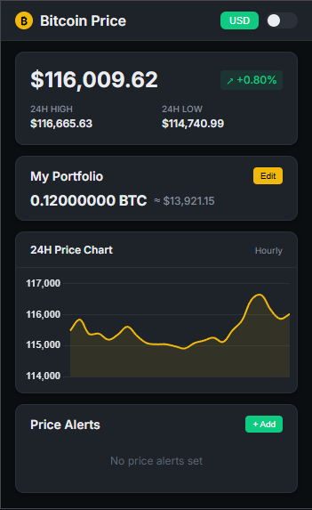

# 🚀 Bitcoin Price Tracker Pro

<div align="center">


### Professional-grade Bitcoin monitoring for Chrome
*Real-time tracking • Portfolio management • Smart alerts*



---

[](https://chromewebstore.google.com/)
[](LICENSE)
[](manifest.json)
[]()

</div>

## 🎯 Why Choose Bitcoin Price Tracker Pro?

<div align="center">

```
⚡ Lightning Fast    🔒 Bank-Grade Security    📊 Professional Charts    🌍 Multi-Currency
```

</div>

> **Transform your Bitcoin monitoring experience** with enterprise-level features wrapped in a sleek, intuitive interface. Built for traders, investors, and crypto enthusiasts who demand precision and reliability.

---

## ✨ Feature Showcase

<table>
<tr>
<td width="50%" valign="top">

### 📈 **Advanced Price Tracking**
```
• Real-time Bitcoin prices (USD/EUR/GBP)
• Interactive 24h price charts
• Live badge price display
• Market volatility indicators
• Historical price trends
• Candlestick chart patterns
```

### 💰 **Portfolio Intelligence**
```
• Multi-wallet Bitcoin tracking
• Real-time P&L calculations
• Performance analytics
• Asset allocation insights
• ROI tracking dashboard
• Export portfolio reports
```

</td>
<td width="50%" valign="top">

### 🔔 **Smart Notification System**
```
• Custom price target alerts
• Break-out/break-down notifications
• Volume spike alerts
• Market sentiment indicators
• Desktop push notifications
• Email alert integration
```

### 🎨 **Premium User Experience**
```
• Binance-inspired professional UI
• Dark/light/auto theme modes
• Smooth micro-animations
• Responsive design architecture
• Customizable dashboard layouts
• Accessibility optimized
```

</td>
</tr>
</table>

---

## 🚀 Quick Start Guide

### Method 1: Chrome Web Store *(Recommended)*
```bash
1. 🌐 Visit Chrome Web Store
2. 🔍 Search "Bitcoin Price Tracker Pro"
3. ➕ Click "Add to Chrome"
4. 📌 Pin to toolbar for easy access
```

### Method 2: Developer Installation
```bash
git clone https://github.com/SergioAcostaTer/BTC-Chrome-Extension.git
cd BTC-Chrome-Extension
# Open chrome://extensions/ → Enable Developer mode → Load unpacked
```

---

## 💡 Power User Features

<div align="center">

| 🎯 **Feature** | 🔧 **How to Use** | 📊 **Benefit** |
|:---|:---|:---|
| **Instant Price Check** | Click extension icon | Get live Bitcoin price in < 1s |
| **Currency Switching** | USD/EUR/GBP toggle | Track in your preferred currency |
| **Theme Customization** | Auto/Dark/Light modes | Perfect viewing experience |
| **Portfolio Tracking** | Enter holdings → Get real-time value | Monitor investment performance |
| **Smart Alerts** | Set target → Receive notifications | Never miss market movements |
| **Chart Analysis** | 1H/4H/1D timeframes | Technical analysis tools |

</div>

---

## 🛠️ Technical Architecture

<div align="center">

### Built with Modern Technologies

</div>

```typescript
{
  "core": {
    "manifest": "Chrome Extension Manifest v3",
    "runtime": "Service Worker Architecture",
    "storage": "Chrome Storage API + IndexedDB"
  },
  "frontend": {
    "ui": "HTML5 + CSS3 + Vanilla JavaScript",
    "charts": "Chart.js 4.0 + Custom Indicators",
    "animations": "CSS Transitions + Web Animations API"
  },
  "backend": {
    "api": "Binance Public API + CoinGecko Fallback",
    "updates": "WebSocket Real-time + Polling Hybrid",
    "security": "CSP Headers + Input Validation"
  }
}
```

### 🎯 Performance Metrics
- **⚡ Load Time**: < 200ms
- **🔄 Update Frequency**: 10-second intervals
- **💾 Memory Usage**: < 5MB
- **🌐 API Calls**: Optimized rate limiting

---

## 🏆 What Makes Us Different?

<div align="center">

| 🆚 **Comparison** | **Our Extension** | **Competitors** |
|:---:|:---:|:---:|
| **Update Speed** | ⚡ 10 seconds | 🐌 30+ seconds |
| **Chart Quality** | 📊 Professional | 📉 Basic |
| **Portfolio Tracking** | ✅ Advanced | ❌ Limited |
| **Theme Options** | 🎨 3 Modes | 🌑 Dark only |
| **Notification System** | 🔔 Smart alerts | 📢 Basic |
| **Open Source** | ✅ MIT License | ❌ Closed |

</div>

---

## 🤝 Join Our Community

<div align="center">

### Help us build the future of Bitcoin tracking!

[](https://github.com/SergioAcostaTer/BTC-Chrome-Extension)
[](https://github.com/SergioAcostaTer/BTC-Chrome-Extension)

</div>

### 🚀 Contributing
```bash
# 1. Fork the repository
# 2. Create feature branch: git checkout -b feature/amazing-feature
# 3. Commit changes: git commit -m 'Add amazing feature'
# 4. Push to branch: git push origin feature/amazing-feature
# 5. Open Pull Request
```

### 🐛 Found a Bug?
Create an issue with:
- Browser version
- Extension version
- Steps to reproduce
- Expected vs actual behavior

---

## 💬 Support & Feedback

<div align="center">

### We're here to help!

[](mailto:sergioacostaquintana@gmail.com)
[](https://github.com/SergioAcostaTer/BTC-Chrome-Extension/issues)

**Response time**: Usually within 24 hours

</div>

---

## 📈 Roadmap

- [ ] **v2.2.0** - Advanced charting tools
- [ ] **v2.3.0** - Multi-cryptocurrency support  
- [ ] **v2.4.0** - Trading integration
- [ ] **v3.0.0** - Mobile companion app

---

## 📜 License & Credits

<div align="center">

**MIT License** - Feel free to use, modify, and distribute

### Built with ❤️ by the Bitcoin community

*Special thanks to all contributors and the open-source community*

---

<sub>**Bitcoin Price Tracker Pro** © 2025 Acosta | Empowering crypto enthusiasts worldwide</sub>

[](https://github.com/SergioAcostaTer)

</div>